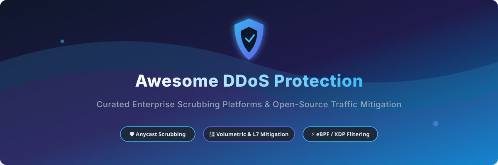

# Awesome-Distributed-Denial-Of-Service-DDoS-Protection 🛡️ 🌊

  

  
  
  
  
  
  

---

## 🌟 Top Distributed Denial of Service (DDoS) Protection Ecosystem

**Curated List of Commercial DDoS Mitigation Platforms & Open-Source Traffic Scrubbing Tools**  
*Focused on Volumetric Attack Mitigation, L3/L4/L7 Protection, BGP Flowspec, Rate Limiting, Anycast Scrubbing & Self-Hosted DDoS Defense*

**Last updated: October 2026** 📅

---

### 📌 Overview & SEO Summary

Welcome to the definitive, high-visibility index for **DDoS protection platforms**, **network scrubbing centers**, and **open-source traffic filtering tools**. Designed for Site Reliability Engineers (SREs), Network Security Architects, and DevSecOps practitioners, this repository provides deep insights into stopping **volumetric flood attacks (SYN, UDP, NTP reflection)**, **application-layer (L7) HTTP/HTTPS attacks**, and **DNS amplification threats**.

Whether evaluating enterprise cloud scrubbing solutions like **AWS Shield Advanced**, **Cloudflare Magic Transit**, **Azure DDoS Protection**, or deploying high-performance eBPF/XDP kernel space packet filters like **FastNetMon** and **xdp-tools**, this directory indexes technical specifications, market scale, and pricing models.

---

## 📑 Table of Contents

- [🏢 SaaS & Commercial Platforms](#-saas--commercial-platforms)
- [🔓 Open-Source GitHub Projects](#-open-source-github-projects)
- [🛠️ How to Contribute](#%EF%B8%8F-how-to-contribute)
- [📊 Star History](#-star-history)
- [🤝 Support & Sponsorship](#-support--sponsorship)
- [⚠️ Disclaimer](#%EF%B8%8F-disclaimer)

---

## 🏢 SaaS / Commercial Platforms

**Market Size & Sector Analysis:**  
The global DDoS mitigation and protection market is estimated at **$4.8 Billion to $12.5 Billion (2024–2026)**, expanding at a CAGR of ~15-18%. The sector is **moderately concentrated** (oligopolistic at the top tier), dominated by major cloud hyperscalers (AWS, Microsoft Azure, Google Cloud) and global Anycast CDN providers (Cloudflare, Akamai, Imperva). However, specialized hardware appliance vendors (Radware, NETSCOUT Arbor, F5) maintain strong positions in enterprise on-premises and ISP scrubbing centers.

*Sorted by Valuation / Market Cap (Descending)* 📈

| SaaS / Commercial Platform | Company / Owner | Valuation / Market Cap | Standard Edition Starting Price | Free Tier / Free Trial Limits | Description |
| :--- | :--- | :--- | :--- | :--- | :--- |
| **[Azure DDoS Protection](https://azure.microsoft.com/en-us/pricing/details/ddos-protection/)** 🔷 | Microsoft | ~$3.1 Trillion | **IP Protection: $199/month per IP**; **Network Protection: $2,944/month** (up to 100 IPs) | **Free Tier:** Infrastructure L3/L4 protection automatically included for all Azure public IPs | **Azure-native DDoS defense** — Offers **per-IP or tenant-wide protection** with adaptive tuning, telemetry analytics, and rapid response support. 🛡️ |
| **[AWS Shield](https://aws.amazon.com/shield/)** ☁️ | Amazon | ~$2.0 Trillion | **Shield Standard: $0**; **Shield Advanced: $3,000/month** (+ DTO fees) | **Free Tier:** Automatic L3/L4 protection for all active AWS accounts | **AWS-native DDoS protection** — **Shield Standard** provides **automatic L3/L4 protection** for all AWS customers. **Shield Advanced** adds **24/7 DDoS Response Team (DRT)**, **cost protection**, **advanced attack diagnostics**, and **WAF integration**. 🌩️ |
| **[Cloudflare Magic Transit / Web DDoS](https://www.cloudflare.com/magic-transit/)** 🟠 | Cloudflare Inc. | ~$30 Billion | **Free / Pro ($20/mo)**; **Magic Transit: Enterprise starting ~$3,000/month** | **Free Tier:** Unmetered L3/L4 & basic L7 protection for websites | **Network-level & Web DDoS protection** — **BGP anycast** with **unmetered DDoS mitigation**. **Cloud firewall, IPsec tunnels, and BGP routing**. **Global network with 330+ cities**. 🌐 |
| **[Akamai Prolexic](https://www.akamai.com/products/prolexic)** 🔴 | Akamai Technologies | ~$15 Billion | **Enterprise starting ~$3,000 - $10,000+/month** | **No Free Tier / Trial:** Guided technical demo available upon request | **Dedicated DDoS scrubbing** — **The most experienced DDoS mitigation provider** — **15+ years of attack data**. **Global scrubbing centers** with **multi-terabit capacity**. 🚨 |
| **[F5 Distributed Cloud DDoS](https://www.f5.com/)** 🔷 | F5 Networks | ~$10 Billion | **Marketplace PAYG ~$3.70/hour** (Enterprise custom packages) | **Free Trial:** Tailored sandbox trial available upon request | **Distributed cloud DDoS protection** — **Multi-cloud DDoS mitigation**. **Integrated with F5 WAF and bot defense**. 🎛️ |
| **[Vercara UltraDDoS Protect](https://vercara.com/)** 🔵 | Vercara (formerly Neustar) | ~$10 Billion | **Enterprise starting ~$5,000+/month** | **No Free Tier / Trial:** Custom architectural consultation & demo available | **Cloud-based DDoS mitigation** — **Global scrubbing centers (15+ Tbps)**. **Always-on or on-demand mitigation**. 📡 |
| **[Imperva DDoS Protection](https://www.imperva.com/)** 🛡️ | Imperva (Thales) | ~$3 Billion | **Enterprise starting ~$500 - $3,000+/month** | **30-Day Free Trial:** Includes app security with 100 Mbps bandwidth limit | **DDoS mitigation and WAF** — **Network and application layer protection**. **Global scrubbing network** with **always-on mitigation**. 🏰 |
| **[NETSCOUT Arbor](https://www.netscout.com/)** 📡 | NETSCOUT | ~$2 Billion | **Enterprise deployment starting ~$250,000+ total contract value** | **No Free Tier / Trial:** Carrier demonstration & POC available upon request | **Network security and DDoS protection** — **Arbor Sightline and Threat Mitigation System**. **The most widely deployed ISP-level DDoS mitigation platform**. 🔍 |
| **[Fastly DDoS Protection](https://www.fastly.com/)** 🟣 | Fastly Inc. | ~$1 Billion | **$50/month minimum base commitment** (Platform Packages from $1,500/mo) | **Free Trial:** $50 usage credit for developer testing and evaluation | **Edge-based DDoS protection** — **Edge cloud platform** with **DDoS mitigation**. **Instant purge and VCL customization**. ⚡ |
| **[Radware DefensePro](https://www.radware.com/)** 🔵 | Radware | ~$1 Billion | **Enterprise starting ~$30,000+ upfront / licensing** | **No Free Tier / Trial:** Formal proof-of-concept / demo available upon request | **On-premises DDoS mitigation** — **Behavioral-based attack detection**. **Inline mitigation** for data centers. 🏢 |
| **[Nexusguard](https://www.nexusguard.com/)** 🟢 | Nexusguard | Private | **Enterprise starting ~$50,000+/year** | **No Free Tier / Trial:** Custom infrastructure assessment & demo available | **DDoS mitigation for service providers** — **Cloud-based scrubbing**. **Peak traffic management**. 🔌 |

---

## 🔓 Open-Source GitHub Projects

*Sorted by GitHub Stars Count (Descending)* 🌟

- **[Fail2Ban](https://github.com/fail2ban/fail2ban)**   
  **Intrusion prevention software**, GPL-2.0 licensed. **Monitors log files (SSH, Apache, Nginx)** and dynamically updates firewall rules (iptables/nftables) to ban malicious IP addresses displaying DDoS or brute-force patterns. 🚫

- **[Suricata](https://github.com/OISF/suricata)**   
  **High-performance network IDS, IPS, and network security monitoring engine**, GPL-2.0 licensed. **Multi-threaded architecture** for high-throughput packet inspection and line-rate DDoS attack signatures. 🦈

- **[Snort 3](https://github.com/snort3/snort3)**   
  **Network intrusion detection and prevention system**, GPL-2.0 licensed. **Next-generation packet inspection engine** capable of detecting volumetric and application-layer DDoS anomalies across high-speed links. 🐷

- **[CrowdSec](https://github.com/crowdsecurity/crowdsec)**   
  **Open-source, community-powered IPS & threat intelligence engine**, MIT licensed. Analyzes visitor behavior, detects Layer 7 DDoS floods, and shares threat blocklists globally among nodes. 👥

- **[LOIC (Low Orbit Ion Cannon)](https://github.com/NewEraCracker/LOIC)**   
  **Network stress testing and DDoS simulation tool**, open-source. **HTTP, TCP, and UDP flood testing utility** widely used in security labs to test defense baseline resiliency. 📡

- **[FastNetMon](https://github.com/pavel-odintsov/fastnetmon)**   
  **High-performance DDoS detection engine**, GPL-2.0 licensed. Parses **sFlow, NetFlow, IPFIX, and SPAN/mirror traffic** to detect attacks in milliseconds. **Integrates with BGP Flowspec & ExaBGP** for automated upstream blackholing/redirection. 🌊

- **[DDoS-Ripper](https://github.com/palahsu/DDoS-Ripper)**   
  **Layer 4 & Layer 7 DDoS simulation tool**, MIT licensed. Multi-threaded penetration testing tool to verify firewall connection limits and server rate-limiting rules. ⚔️

- **[DDoS Deflate](https://github.com/rastating/ddos-deflate)**   
  **Lightweight shell script for Linux DDoS mitigation**, GPL-3.0 licensed. Monitors active TCP/UDP connections via `netstat`/`ss` and automatically drops abusive IPs using `iptables` or `APF`. 🛡️

- **[xdp-tools / XDP DDoS Filter](https://github.com/xdp-project/xdp-tools)**   
  **eBPF / XDP utilities for Linux kernel packet filtering**, GPL-2.0 licensed. Executes packet drop logic directly in the network driver layer, achieving **line-rate DDoS filtering at 100Gbps+**. ⚡

- **[OpenAppFilter](https://github.com/destan19/OpenAppFilter)**   
  **OpenWrt application firewall plugin**, GPL-3.0 licensed. Deep packet inspection module for Linux embedded routers to filter unwanted traffic and rate-limit abusive endpoints. 🔌

- **[XDP DDoS Mitigation](https://github.com/xtby/xdp-ddos-mitigation)**   
  **High-performance eBPF/XDP packet scrubber**, open-source. Filters UDP/SYN flood traffic directly inside Linux kernel network driver hooks. ⚡

- **[DDoS Mitigation Scripts Directory](https://github.com/topics/ddos-mitigation)**   
  **Curated GitHub topic index for DDoS defense scripts**, community-maintained. Includes hundreds of custom Nginx rate-limiting configs, iptables rules, and BGP automation hooks. 🗂️

---

## 🛠️ How to Contribute

Contributions are welcome! Follow these steps to submit new DDoS protection platforms or open-source mitigation software:

1. 🍴 **Fork** the repository.
2. 📝 **Add/edit** entries in `README.md` maintaining table/list structure and formatting.
3. 🔗 Include project title, official website/GitHub link, exact star count, license, and brief description.
4. 🚀 Submit a **Pull Request** with a descriptive summary of your changes.

---

## 📊 Star History

---

## 🤝 Support & Sponsorship

If you find this DDoS protection repository useful, please consider supporting the project:

- ⭐ **Star** this repository to increase visibility!
- 🔀 **Fork** and share with fellow security engineers, network operators, and open-source advocates.
- ☕ **Sponsor & Buy Me a Coffee**: Support ongoing open-source curation via the [GitHub Sponsor Dashboard](https://github.com/sponsors/ishandutta2007).

---

## ⚠️ Disclaimer

- This is a **community-curated** list — not exhaustive and not an endorsement. ℹ️
- **AWS Shield Standard is free** for all AWS customers — **Shield Advanced costs $3,000/month plus data transfer**. **Cloudflare Magic Transit provides unmetered DDoS mitigation** on Enterprise plans. **Azure DDoS Protection costs $2,944/month per 100 public IPs**.
- **FastNetMon is the leading open-source DDoS detection tool** — **BGP Flowspec integration enables automated mitigation**. **DDoS Deflate and Fail2Ban provide application-layer protection** for Linux servers. **XDP-based filters provide line-rate mitigation**.
- **Open-source DDoS tools are not turnkey** — they require **network infrastructure (BGP routers, scrubbing capacity), configuration, and ongoing maintenance**. **Always validate detection accuracy and mitigation effectiveness with a proof-of-concept** before production deployment. 🛡️

---

  <b>Made with ❤️ for security engineers, network operators, and open-source DDoS protection advocates.</b>

